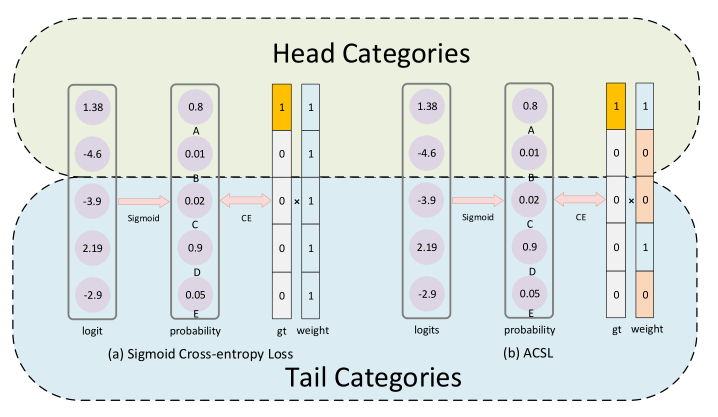

# Adaptive Class Suppression Loss for Long-Tail Object Detection


This repo is the official implementation for CVPR 2021 paper: **Adaptive Class Suppression Loss for Long-Tail Object Detection**.
[[Paper]](link)





## Requirements

### 1. Environment:
The requirements are exactly the same as [BalancedGroupSoftmax](https://github.com/FishYuLi/BalancedGroupSoftmax). We tested on the following settings:

- python 3.7
- cuda 10.0
- pytorch 1.2.0
- torchvision 0.4.0
- [mmcv 0.2.14](https://github.com/open-mmlab/mmcv/tree/v0.2.14)

```setup
conda create -n mmdet python=3.7 -y
conda activate mmdet

pip install cython
pip install numpy
pip install torch
pip install torchvision
pip install pycocotools
pip install matplotlib
pip install terminaltables

git clone https://github.com/CASIA-IVA-Lab/ACSL.git

cd ACSL/lvis-api/
python setup.py develop

cd ../
python setup.py develop
```

### 2. Data:
#### a. For dataset images:

```shell=
# Make sure you are in dir ACSL

mkdir data
cd data
mkdir lvis
mkdir pretrained_models
mkdir download_models
```
    
- If you already have COCO2017 dataset, it will be great. Link `train2017` and `val2017` folders under folder `lvis`.
- If you do not have COCO2017 dataset, please download:
        [COCO train set](http://images.cocodataset.org/zips/train2017.zip) and 
        [COCO val set](http://images.cocodataset.org/zips/val2017.zip)
        and unzip these files and mv them under folder `lvis`.

#### b. For dataset annotations:
- Download lvis annotations:
        [lvis_train_ann](https://s3-us-west-2.amazonaws.com/dl.fbaipublicfiles.com/LVIS/lvis_v0.5_train.json.zip) and
        [lvis_val_ann](https://s3-us-west-2.amazonaws.com/dl.fbaipublicfiles.com/LVIS/lvis_v0.5_val.json.zip).
- Unzip all the files and put them under `lvis`, 


#### c. For pretrained models:
> Download the corresponding pre-trained models [below](#models).
- To train baseline models, we need models trained on COCO to initialize. Please download the corresponding COCO models at [mmdetection model zoo](https://github.com/open-mmlab/mmdetection/blob/v1.0rc0/MODEL_ZOO.md).

- Move these model files to `./data/pretrained_models/`

#### d. For download_models:
> Download the trained baseline models and **ACSL** models from [BaiduYun](https://pan.baidu.com/s/125NL9PhQ33JZuVJ6AzKgIw), code is **2jp3**
- To train ACSL models, we need corresponding baseline models trained on LVIS to initialize and fix all parameters except for the last FC layer.

- Move these model files to `./data/download_models/`

**After all these operations, the folder `data` should be like this:**
```
    data
    ├── lvis
    │   ├── lvis_v0.5_train.json
    │   ├── lvis_v0.5_val.json
    │   ├── train2017
    │   │   ├── 000000100582.jpg
    │   │   ├── 000000102411.jpg
    │   │   ├── ......
    │   └── val2017
    │       ├── 000000062808.jpg
    │       ├── 000000119038.jpg
    │       ├── ......
    └── pretrained_models
    │       ├── faster_rcnn_r50_fpn_2x_20181010-443129e1.pth
    │       ├── ......
    └── download_models
            ├── R50-baseline.pth
            ├── ......
```

## Training

> **Note:** Please make sure that you have prepared the pretrained_models and the download_models and they have been put to the path specified in  `${CONIFG_FILE}`. 

Use the following commands to train a model.


```train
# Single GPU
python tools/train.py ${CONFIG_FILE}

# Multi GPU distributed training
./tools/dist_train.sh ${CONFIG_FILE} ${GPU_NUM} [optional arguments]
```
All config files are under `./configs/`.
- `./configs/baselines`: all baseline models.
- `./configs/acsl`: models for ACSL models.

For example, to train a **ACSL** model with Faster R-CNN R50-FPN:
```train
# Single GPU
python tools/train.py configs/acsl/faster_rcnn_r50_fpn_1x_lvis_tunefc_acsl.py

# Multi GPU distributed training (for 8 gpus)
./tools/dist_train.sh configs/acsl/faster_rcnn_r50_fpn_1x_lvis_tunefc_acsl.py 8
```  

> ***Important***: The default learning rate in config files is for 8 GPUs and 2 img/gpu (batch size = 8*2 = 16). According to the Linear Scaling Rule, you need to set the learning rate proportional to the batch size if you use different GPUs or images per GPU, e.g., lr=0.01 for 4 GPUs * 2 img/gpu and lr=0.08 for 16 GPUs * 4 img/gpu. (Cited from [mmdetection](https://github.com/open-mmlab/mmdetection/blob/v1.0rc0/GETTING_STARTED.md).)


## Testing

Use the following commands to test a trained model. 
```test
# single gpu test
python tools/test_lvis.py \
 ${CONFIG_FILE} ${CHECKPOINT_FILE} [--out ${RESULT_FILE}] [--eval ${EVAL_METRICS}]

# multi-gpu testing
./tools/dist_test_lvis.sh \
 ${CONFIG_FILE} ${CHECKPOINT_FILE} ${GPU_NUM} [--out ${RESULT_FILE}] [--eval ${EVAL_METRICS}]
```

> - `$RESULT_FILE`: Filename of the output results in pickle format. If not specified, the results will not be saved to a file.
> - `$EVAL_METRICS`: Items to be evaluated on the results. `bbox` for bounding box evaluation only. `bbox segm` for bounding box and mask evaluation.

For example (assume that you have finished the training of **ACSL** models.):
- To evaluate the trained **ACSL** model with Faster R-CNN R50-FPN for object detection:
```eval
# single-gpu testing
python tools/test_lvis.py configs/acsl/faster_rcnn_r50_fpn_1x_lvis_tunefc_acsl.py \
 ./work_dirs/acsl/faster_rcnn_r50_fpn_1x_lvis_tunefc_acsl/epoch_12.pth \
  --out acsl_val_result.pkl --eval bbox

# multi-gpu testing (8 gpus)
./tools/dist_test_lvis.sh configs/acsl/faster_rcnn_r50_fpn_1x_lvis_tunefc_acsl.py \
./work_dirs/acsl/faster_rcnn_r50_fpn_1x_lvis_tunefc_acsl/epoch_12.pth 8 \
--out acsl_val_result.pkl --eval bbox
```


## Results and models

Please refer to our [paper](http://openaccess.thecvf.com/content_CVPR_2020/papers/Li_Overcoming_Classifier_Imbalance_for_Long-Tail_Object_Detection_With_Balanced_Group_CVPR_2020_paper.pdf) for more details.

| Method   | Models       | bbox mAP | Config file                                                             |   Pretrained Model          |            Model          |
| -------- | ------------ | -------- | ----------------------------------------------------------------------- | --------------------------- | ------------------------- |
| baseline | R50-FPN      | 21.18    | [file](configs/baselines/faster_rcnn_r50_fpn_1x_lvis.py)                |   [COCO-R50](https://s3.ap-northeast-2.amazonaws.com/open-mmlab/mmdetection/models/faster_rcnn_r50_fpn_2x_20181010-443129e1.pth)          |   [R50-baseline](https://pan.baidu.com/s/125NL9PhQ33JZuVJ6AzKgIw)    |
| **ACSL**     | R50-FPN      | 26.36    | [file](configs/acsl/faster_rcnn_r50_fpn_1x_lvis_tunefc_acsl.py)         |   [R50-baseline](https://pan.baidu.com/s/125NL9PhQ33JZuVJ6AzKgIw)      |              [R50-acsl](https://pan.baidu.com/s/125NL9PhQ33JZuVJ6AzKgIw)             |
| baseline | R101-FPN     | 22.36    | [file](configs/baselines/faster_rcnn_r101_fpn_1x_lvis.py)               |   [COCO-R101](https://s3.ap-northeast-2.amazonaws.com/open-mmlab/mmdetection/models/faster_rcnn_r101_fpn_2x_20181129-73e7ade7.pth)         |   [R101-baseline](https://pan.baidu.com/s/125NL9PhQ33JZuVJ6AzKgIw)   |
| **ACSL**     | R101-FPN     | 27.49    | [file](configs/acsl/faster_rcnn_r101_fpn_1x_lvis_tunefc_acsl.py)        |   [R101-baseline](link)     |   [R101-acsl](https://pan.baidu.com/s/125NL9PhQ33JZuVJ6AzKgIw)    |
| baseline | X101-FPN     | 24.70    | [file](configs/baselines/faster_rcnn_x101_64x4d_fpn_1x_lvis.py)         |   [COCO-X101](https://s3.ap-northeast-2.amazonaws.com/open-mmlab/mmdetection/models/faster_rcnn_x101_64x4d_fpn_1x_20181218-c9c69c8f.pth)         |   [X101-baseline](https://pan.baidu.com/s/125NL9PhQ33JZuVJ6AzKgIw)     |
| **ACSL**     | X101-FPN     | 28.93    | [file](configs/acsl/faster_rcnn_x101_64x4d_fpn_1x_lvis_tunefc_acsl.py)  |   [X101-baseline](https://pan.baidu.com/s/125NL9PhQ33JZuVJ6AzKgIw)     |   [X101-acsl](https://pan.baidu.com/s/125NL9PhQ33JZuVJ6AzKgIw)    |
| baseline | Cascade-R101 | 25.14    | [file](configs/baselines/cascade_rcnn_r101_fpn_1x_lvis.py)              |   [COCO-Cas-R101](https://s3.ap-northeast-2.amazonaws.com/open-mmlab/mmdetection/models/cascade_rcnn_r101_fpn_20e_20181129-b46dcede.pth) |   [Cas-R101-baseline](https://pan.baidu.com/s/125NL9PhQ33JZuVJ6AzKgIw)    |
| **ACSL**     | Cascade-R101 | 29.71    | [file](configs/acsl/cascade_rcnn_r101_fpn_1x_lvis_tunefc_acsl.py)       |[Cas-R101-baseline](https://pan.baidu.com/s/125NL9PhQ33JZuVJ6AzKgIw)|   [Cas-R101-acsl](https://pan.baidu.com/s/125NL9PhQ33JZuVJ6AzKgIw)    |
| baseline | Cascade-X101 | 27.14    | [file](configs/baselines/cascade_rcnn_x101_64x4d_fpn_1x_lvis.py)        |   [COCO-Cas-X101](https://s3.ap-northeast-2.amazonaws.com/open-mmlab/mmdetection/models/cascade_rcnn_x101_64x4d_fpn_2x_20181218-5add321e.pth) |   [Cas-X101-baseline](https://pan.baidu.com/s/125NL9PhQ33JZuVJ6AzKgIw)    |
| **ACSL**     | Cascade-X101 | 31.47    | [file](configs/acsl/cascade_rcnn_x101_64x4d_fpn_1x_lvis_tunefc_acsl.py) |[Cas-X101-baseline](https://pan.baidu.com/s/125NL9PhQ33JZuVJ6AzKgIw)|   [Cas-X101-acsl](https://pan.baidu.com/s/125NL9PhQ33JZuVJ6AzKgIw)    |
> ***Important***: The code of BaiduYun is **2jp3**


## Citation
```citation
@inproceedings{wang2021adaptive,
  title={Adaptive Class Suppression Loss for Long-Tail Object Detection},
  author={Wang, Tong and Zhu, Yousong and Zhao, Chaoyang and Zeng, Wei and Wang, Jinqiao and Tang, Ming},
  journal={CVPR},
  year={2021}
}
```

## Credit
This code is largely based on [**BalancedGroupSoftmax**](https://github.com/FishYuLi/BalancedGroupSoftmax) and [**mmdetection v1.0.rc0**](https://github.com/open-mmlab/mmdetection/tree/v1.0rc0) and [**LVIS API**](https://github.com/lvis-dataset/lvis-api).
